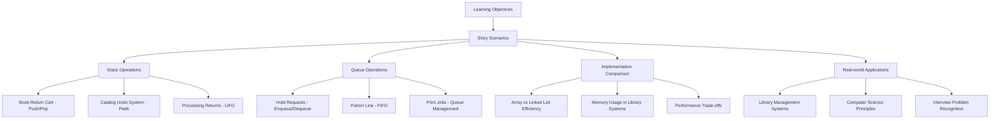

# 📚 Module 5 Transformation Plan: The Willowbrook Library Story

## 🎯 Project Overview
Transform the current dry, technical Module 5 (Stacks and Queues) into an engaging narrative-driven learning experience set in Willowbrook Public Library. The story will follow characters through their daily library operations, naturally introducing LIFO and FIFO concepts through relatable scenarios.

## 📖 Core Narrative Framework

### Setting
**Willowbrook Public Library** - a bustling community library

### Main Characters
- **Maya Chen** - Head Librarian (experienced, organized, teaches concepts)
- **Alex Rivera** - New Library Assistant (learner, asks questions)
- **Sam Thompson** - Student volunteer (enthusiastic, makes mistakes, learns)
- **Various patrons** - Community members with different needs

### Story Arc
Alex's first week as a library assistant, learning the systems and procedures that naturally demonstrate stack and queue principles.

## 🗺️ Chapter-by-Chapter Transformation Plan

### Priority 1: Core Learning Objective Chapters (Heavy narrative focus)

#### 1. Stacks Introduction → "The Book Return System"
**Scene**: Alex's first day, Maya explains the book return cart system

**Story Elements**: 
- Books returned throughout the day pile up in a cart (stack)
- Maya explains why they process returns from top to bottom (LIFO)
- Alex learns about the "last book in, first book out" principle

**Learning Integration**: 
- LIFO principle through book return processing
- Stack operations (push = adding books, pop = processing returns)
- Real-world applications (undo operations = fixing catalog mistakes)

#### 2. Queues Introduction → "The Hold Request System"
**Scene**: Busy Saturday morning, popular book has multiple hold requests

**Story Elements**:
- Patrons place holds on popular books (queue formation)
- Maya shows Alex the hold list - first person to request gets it first (FIFO)
- Sam accidentally tries to give book to wrong person, learns about fairness

**Learning Integration**:
- FIFO principle through hold request processing
- Queue operations (enqueue = placing hold, dequeue = fulfilling request)
- Real-world applications (print queues, customer service)

#### 3. Implement Stack → "Building the Book Cart System"
**Scene**: Alex needs to create a digital tracking system for the book return cart

**Story Elements**:
- Maya guides Alex through creating a simple tracking system
- They implement push (adding books), pop (processing books), peek (checking top book)
- Sam tests the system and discovers edge cases (empty cart scenarios)

**Learning Integration**:
- Hands-on implementation of stack operations
- Error handling (empty stack scenarios)
- Time complexity understanding through practical examples

#### 4. Implement Queue → "Digitizing the Hold System"
**Scene**: The library upgrades from paper hold lists to digital system

**Story Elements**:
- Alex builds a digital hold queue system
- Maya explains why array-based queues are inefficient (shifting patrons in line)
- They implement a better solution using linked lists

**Learning Integration**:
- Queue implementation with different approaches
- Performance trade-offs through practical scenarios
- Understanding O(1) vs O(n) operations

### Priority 2: Supporting Chapters (Moderate narrative integration)

#### 5. Implementation Tradeoffs → "Choosing the Right System"
**Scene**: Library board meeting, discussing system efficiency

**Story Elements**:
- Maya presents different approaches to the board
- Cost-benefit analysis of different implementations
- Real-world constraints (memory, speed, maintenance)

#### 6. Info Sheet → "Quick Reference Guide"
**Format**: Maya's training manual for new staff
**Integration**: Reference guide with library-themed examples

### Priority 3: Minimal Changes (Light thematic touches)

#### 7. Glossary → "Library Staff Handbook"
**Format**: Staff handbook with library-contextualized definitions
**Integration**: Terms explained with library examples where relevant

## 🎨 Narrative Techniques

### Character Development
- **Alex**: Represents the learner, asks questions students would ask
- **Maya**: Expert mentor, explains concepts clearly and patiently
- **Sam**: Makes common mistakes, shows learning through errors

### Dialogue Style
```
"But Maya," Alex said, looking at the towering stack of returned books, 
"why don't we just process them in the order they were returned?"

Maya smiled, picking up the book from the very top of the pile. 
"Think about it - which book is easiest to reach? The one on top, right? 
That's the beauty of our system. The last book that came back is the 
first one we can grab. We call this LIFO - Last In, First Out."
```

### Scenario-Based Learning
- Each concept introduced through a realistic library situation
- Problems arise naturally from the story context
- Solutions emerge through character collaboration

## 📊 Learning Objective Mapping



## 🔧 Technical Integration Strategy

### Code Examples
- All code examples will be library-themed
- Variable names: `bookStack`, `holdQueue`, `patron`, `librarian`
- Comments reference library operations
- Error messages in library context

### Practical Applications
- Book return processing system
- Hold request management
- Catalog undo functionality
- Print job scheduling
- Event registration queues

## 📝 Content Structure Per Chapter

### Opening Hook (2-3 paragraphs)
- Scene setting with characters
- Natural problem introduction
- Emotional engagement

### Concept Introduction (Through Dialogue/Action)
- Characters discover the need for the concept
- Natural explanation through mentor-student interaction
- Visual analogies with library operations

### Technical Deep Dive (Integrated with Story)
- Implementation guided by story needs
- Code examples with library context
- Testing through character interactions

### Reinforcement (Story Resolution)
- Characters successfully apply the concept
- Reflection on learning
- Connection to broader library operations

## 🎯 Success Metrics

### Learning Objective Alignment
- ✅ Each learning objective addressed through specific story scenarios
- ✅ Hands-on implementation guided by narrative needs
- ✅ Performance understanding through practical examples
- ✅ Real-world application recognition through library context

### Engagement Factors
- ✅ Continuous character development
- ✅ Relatable scenarios and problems
- ✅ Emotional investment in outcomes
- ✅ Natural progression of complexity

### Technical Accuracy
- ✅ All code examples functional and tested
- ✅ Correct time complexity explanations
- ✅ Accurate implementation comparisons
- ✅ Proper error handling demonstrations

## 📅 Implementation Timeline

1. **Phase 1**: Core narrative chapters (stacks-intro, queues-intro)
2. **Phase 2**: Implementation chapters (implement-stack, implement-queue)
3. **Phase 3**: Supporting chapters (implementation-tradeoffs)
4. **Phase 4**: Reference materials (info-sheet, glossary)
5. **Phase 5**: Review and narrative consistency check

## 🎭 Character Interaction Examples

### Maya's Teaching Style
- Patient and encouraging
- Uses analogies and real-world examples
- Asks guiding questions to help others discover concepts
- Shares practical wisdom from years of experience

### Alex's Learning Journey
- Curious and eager to understand
- Asks clarifying questions
- Makes connections between concepts
- Grows more confident throughout the story

### Sam's Role
- Enthusiastic but sometimes hasty
- Makes mistakes that lead to learning opportunities
- Represents common student misconceptions
- Provides comic relief while reinforcing concepts

## 📚 Library Setting Details

### Physical Spaces
- **Main circulation desk**: Where hold requests are managed
- **Book return area**: Where the stack system operates
- **Staff workroom**: Where digital systems are developed
- **Reading areas**: Where patrons wait and interact

### Daily Operations
- **Morning setup**: Preparing systems for the day
- **Rush periods**: Testing system efficiency under load
- **Quiet times**: Opportunity for learning and reflection
- **Closing procedures**: Reviewing and optimizing processes

This comprehensive plan transforms the technical content into an engaging narrative while maintaining rigorous adherence to learning objectives. The library setting provides natural, relatable contexts for understanding abstract computer science concepts, making them memorable and applicable to real-world scenarios.